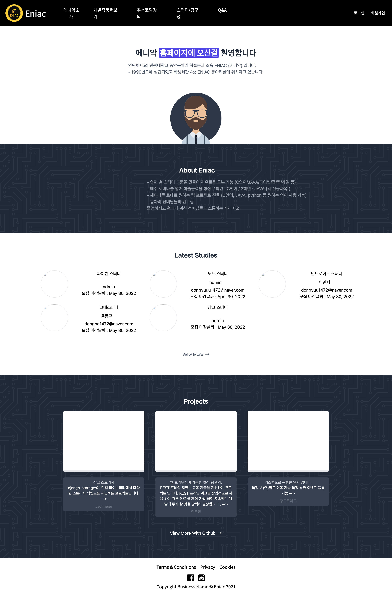
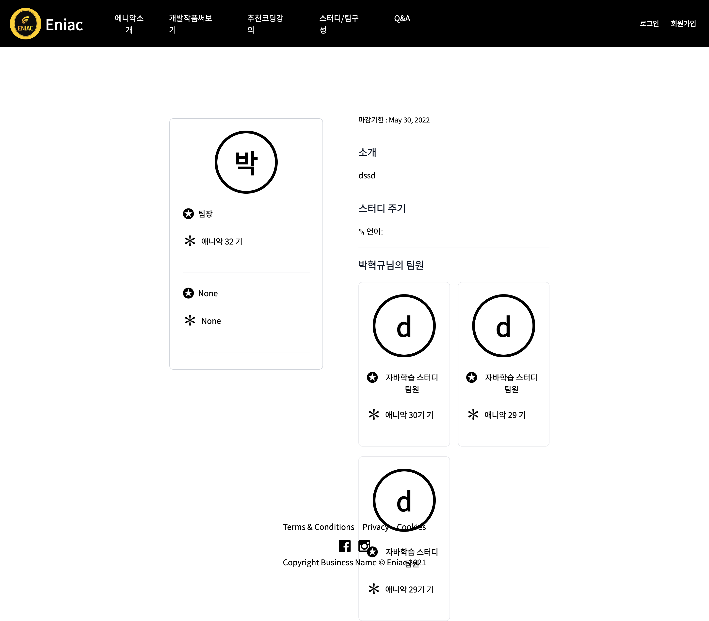
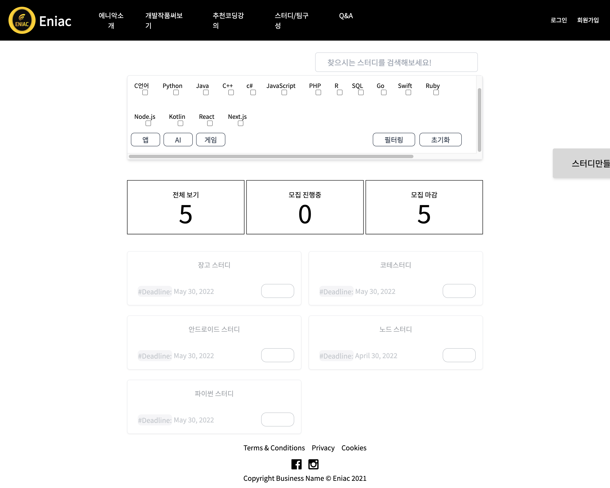

Eniac Club Homepage

개요
에니악 동아리 홈페이지는 원광대학교 컴퓨터 소프트웨어학과 소속 동아리 에니악의 동아리원들을 위한 플랫폼입니다. 동아리원들의 원활한 활동 관리 및 스터디 참여를 돕고, 프로젝트 성과를 한눈에 확인할 수 있는 기능을 제공합니다. 이 사이트를 통해 동아리원들은 경쟁 의식을 높이고, 협업을 강화하여 개인의 성장과 동아리 전체의 발전을 목표로 합니다.

배포
본 프로젝트는 AWS(Amazon Web Services)를 통해 배포가 완료되었습니다. 지속적인 업데이트와 유지 보수가 이루어질 예정입니다.

배포 URL
Eniac Club Homepage on AWS

주요 기능

1. 스터디 관리

현재 진행 중인 스터디와 마감된 스터디를 쉽게 확인할 수 있습니다.
스터디 참여 신청 및 관리가 가능합니다.
 2. 프로젝트 전시

동아리원들이 진행한 프로젝트를 한눈에 볼 수 있으며, 각 프로젝트에 대한 설명과 결과물을 확인할 수 있습니다.
GitHub 연동을 통해 프로젝트 소스 코드도 쉽게 접근할 수 있습니다.

3. 동아리원 활동 기록

동아리원들의 스터디 참여 기록 및 팀 구성을 한눈에 볼 수 있습니다.
개인의 학습 이력을 관리하고, 팀 단위 활동을 효율적으로 파악할 수 있습니다.

기술 스택
Frontend: HTML, CSS, JavaScript
Backend: Django
Database: PostgreSQL
배포: AWS (EC2, S3, RDS)
설치 및 실행 방법
이 리포지토리를 클론합니다:

bash

git clone https://github.com/your-repo/eniac-club-homepage.git
필요한 패키지를 설치합니다:

bash

pip install -r requirements.txt
데이터베이스 마이그레이션을 적용합니다:

bash

python manage.py migrate
서버를 실행합니다:

bash

python manage.py runserver
